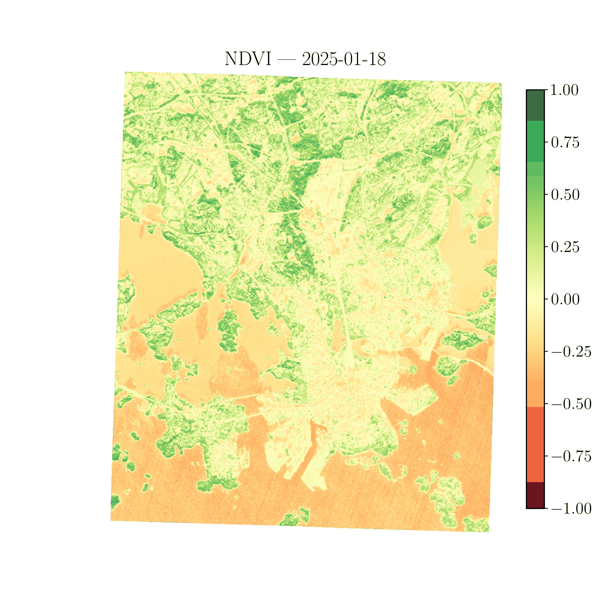
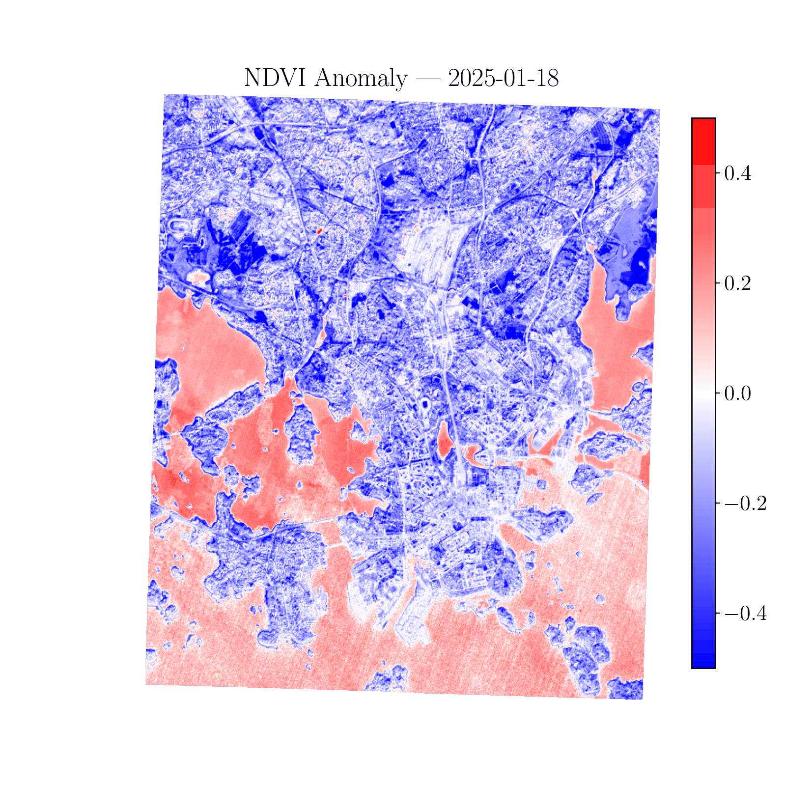

# 🌿 NDVI Vegetation Monitoring Pipeline
### Sentinel-2 Multispectral Analysis — Helsinki, 2025

A Python-based pipeline for computing, analysing, and validating the **Normalized Difference Vegetation Index (NDVI)** from Sentinel-2 satellite imagery. Applies time-series analysis across 12 monthly acquisitions, detects seasonal phenological transitions, and validates results against a **MODIS MOD13A3 climatological reference** (2010–2023) extracted via Google Earth Engine.

This project computes the Normalized Difference Vegetation Index (NDVI) from Sentinel-2 satellite imagery. 
You can download images and data about your area of interest (AOI) in the .


## Workflow and NDVI explanation
Select your AOI and download Sentinel-2 dataset (raw images as GeoTIFF files), which you can find in open-source dataspace of [Copernicus](https://dataspace.copernicus.eu).
Satellite sensors do not just take RGB pictures. Instead, they measure light intensity at many different wavelengths of the electromagnetic spectrum.
You need two bands, `B04` (RED ~ 665 nm) and `B08` (near infra-red, or NIR ~ 842 nm). 
Plants absorb red light during photosynthesis, so that healthy vegetation has a low red-light reflectance, while water has very low red-light reflectance, and dry soil medium red-light reflectance. 
On the opposite, plant leaves strongly reflect near-infrared light because of their internal structure, so that healthy vegetation has very high NIR reflectance, water has very low, and dry soil medium. 


Once you have the two bands, you can combine them to form the Normalized Difference Vegetation Index (NDVI) according to the formula
```math
NDVI = \frac{NIR-RED}{NIR+RED}
```
Typical NDVI values are:
| NDVI  | Meaning |
| ------------- | ------------- |
| < 0           | water         |
| 0 - 0.2       | bare soil     |
| 0.2 - 0.4     | sparse vegetation |
| > 0.4         | dense vegetation  |


## Example
Here I show an example of the NDVI computed around the metropolitan area of Helsinki on date 20 June 2025 (near midsummer). 


### Variation of NDVI across year 2025
It is interesting to see how the NDVI index changes throughout the year. The following animations show the NDVI index computed from a selected day per month. Days are chosen so that cloud coverage is below 15%. 


Finally we compute the anomaly in the NDVI index. For every frame, this is computed as the difference between the local NDVI and its average across all frame.



---


## Validation Methodology

Results are validated against **MODIS MOD13A3** monthly NDVI composites (Collection 6.1, 1 km resolution) extracted over a 2 km radius centred on Helsinki city centre (60.1699°N, 24.9384°E) using **Google Earth Engine**. The 14-year climatology (2010–2023) provides monthly mean ± 1σ interannual variability as a reference baseline.

> *Reference dataset*: MODIS/061/MOD13A3, Google Earth Engine.
> *Extraction script*: `extract_modis_ndvi_reference.py`

---

## Pipeline Overview

```
Sentinel-2 GeoTIFF (B04, B08)
        │
        ▼
  Radiometric loading + reprojection (Rasterio)
        │
        ▼
  NDVI computation: (NIR − Red) / (NIR + Red)
        │
        ▼
  Per-date statistics
  (mean, median, veg fraction, veg area km²)
        │
        ▼
  Phenology detection
  (green-up onset, peak, senescence, growing season length)
        │
        ▼
  Validation vs MODIS MOD13A3 climatology
  (RMSE, bias, ±1σ agreement)
        │
        ▼
  Outputs: time series plot, vegetation area chart,
           NDVI animation, anomaly animation, GeoTIFF
```

---

## Repository Structure

```
├── ndvi_timeseries_enhanced.py       # Main pipeline
├── extract_modis_ndvi_reference.py   # GEE MODIS reference extraction
├── modis_ndvi_reference.csv          # MODIS climatology (output of GEE script)
├── modis_ndvi_timeseries_full.csv    # Full MODIS monthly time series 2010–2023
├── Copernicus_images/
│   └── Helsinki/
│       └── 2025/
│           ├── Helsinki_2025_01_18/
│           │   ├── *B04*.tiff        # Red band
│           │   └── *B08*.tiff        # NIR band
│           ├── Helsinki_2025_02_25/
│           │   └── ...
│           └── ...                   # one folder per acquisition date
└── outputs/
    ├── ndvi_timeseries_plot.png
    ├── ndvi_vegetation_area.png
    ├── ndvi_timeseries.gif
    ├── ndvi_anomalies.gif
    └── ndvi_colormap.tiff
```


## Key Findings

| Metric | Value |
|---|---|
| Scene coverage | ~109 km² (Helsinki metropolitan area) |
| Acquisitions analysed | 12 (Jan–Dec 2025) |
| Peak vegetated area | ~42 km² (June–August) |
| Winter vegetated area | ~5 km² (evergreen conifers only) |
| Peak mean NDVI | 0.274 (2025-06-04) |
| RMSE vs MODIS reference | 0.133 |
| Bias vs MODIS reference | −0.107 (underestimate) |
| Winter validation (Jan, Feb, Dec) | Within ±1σ of MODIS reference |

---

## Scientific Findings

**1. Seasonal dynamics correctly captured.**
Vegetated area grows from ~5 km² in winter dormancy to ~42 km² at peak growing season (June–August), consistent with Helsinki's boreal urban phenology. The summer plateau (June–August vegetated area stable at ~42 km²) reflects full canopy closure rather than continued expansion.

**2. Spatial scale critically affects validation quality.**
Expanding the MODIS reference extraction radius from 2 km to 25 km increases RMSE from 0.133 to 0.393. The surrounding boreal forest belt (Nuuksio, Sipoonkorpi) dominates at larger radii, inflating the reference NDVI well above urban scene values. Matching the reference to the scene extent is essential for meaningful validation.

**3. Urban mixed-pixel dilution effect identified.**
Growing season underestimation of 0.08–0.24 NDVI units relative to MODIS is consistent with 1 km MODIS pixels blending vegetated and impervious surfaces, while Sentinel-2 at 10 m resolves them separately. Winter months (January, February, December) show excellent agreement (diff < 0.03) confirming correct radiometric calibration — the growing-season bias is physical, not instrumental.

**4. Evergreen conifer signal detected in autumn.**
October vegetation fraction (37.3%, 40.7 km²) is nearly equal to the summer peak despite scene-mean NDVI collapsing to 0.043. The mean-median divergence (mean=0.043, median=0.198) reveals that evergreen pine and spruce maintain NDVI > 0.4 through October while deciduous trees senesce, pulling the scene mean down. This urban forest composition signal is not visible in coarser-resolution products.

**5. Cloud-contaminated acquisition automatically identified.**
March 2025 measured mean NDVI of −0.122 against a MODIS reference of 0.051 ± 0.046 (diff = −0.173). Negative mean NDVI is physically inconsistent with snow-free or partially snow-covered surfaces and indicates residual cloud or wet snow contamination not removed by basic quality screening. A production pipeline would apply the Sentinel-2 **Scene Classification Layer (SCL)** to automatically mask such acquisitions.


The extension of vegetated areas (NDVI>4) per each month are shown in this Figure.


A comparison between our analysis from Copernicus data and MOD13A3 is finally shown in this Figure.


---

## Requirements

```bash
pip install rasterio numpy matplotlib scipy earthengine-api pandas geopandas
```

For Google Earth Engine authentication (required only for `extract_modis_ndvi_reference.py`):

```bash
earthengine authenticate
```

---

## Usage

### Step 1 — Extract MODIS reference (once)

```bash
python extract_modis_ndvi_reference.py
```

This queries Google Earth Engine and saves `modis_ndvi_reference.csv` locally. Requires a GEE account and an authenticated session. Run once — the CSV is then used by the main pipeline.

### Step 2 — Run the main pipeline

```bash
python ndvi_timeseries_enhanced.py
```

Expects Sentinel-2 GeoTIFF files organised under `Copernicus_images/Helsinki/2025/` with one subfolder per acquisition date named `Helsinki_YYYY_MM_DD`. Download imagery from the [Copernicus Browser](https://browser.dataspace.copernicus.eu) — select Sentinel-2 L2A, bands B04 (Red) and B08 (NIR), GeoTIFF format, 10 m resolution.

---

## Data Sources

| Dataset | Source | Resolution | Period |
|---|---|---|---|
| Sentinel-2 L2A (B04, B08) | [Copernicus Browser](https://browser.dataspace.copernicus.eu) | 10 m | Jan–Dec 2025 |
| MODIS MOD13A3 NDVI | [Google Earth Engine](https://developers.google.com/earth-engine/datasets/catalog/MODIS_061_MOD13A3) | 1 km | 2010–2023 |

---

## Technical Notes

- **Reprojection**: all scenes reprojected to a north-up grid at 10 m native resolution using bilinear resampling before NDVI computation
- **Vegetation threshold**: NDVI > 0.4 used for vegetated pixel classification; scene-mean phenology detection uses threshold of 0.15 due to urban dilution of scene-mean values
- **MODIS scale factor**: raw MODIS NDVI values multiplied by 0.0001 to convert to the standard [−1, 1] range
- **Known limitation**: ~monthly temporal resolution is insufficient to precisely resolve phenological transition dates; green-up onset is estimated within a ~30-day window rather than a specific date

---

## Author

**Lorenzo Giombi, Ph.D.**
Computational Scientist | SAR/EO Data Scientist
[LinkedIn](https://linkedin.com/in/lorenzo-giombi-phd) · [GitHub](https://github.com/lorenzogiombi-hub)
